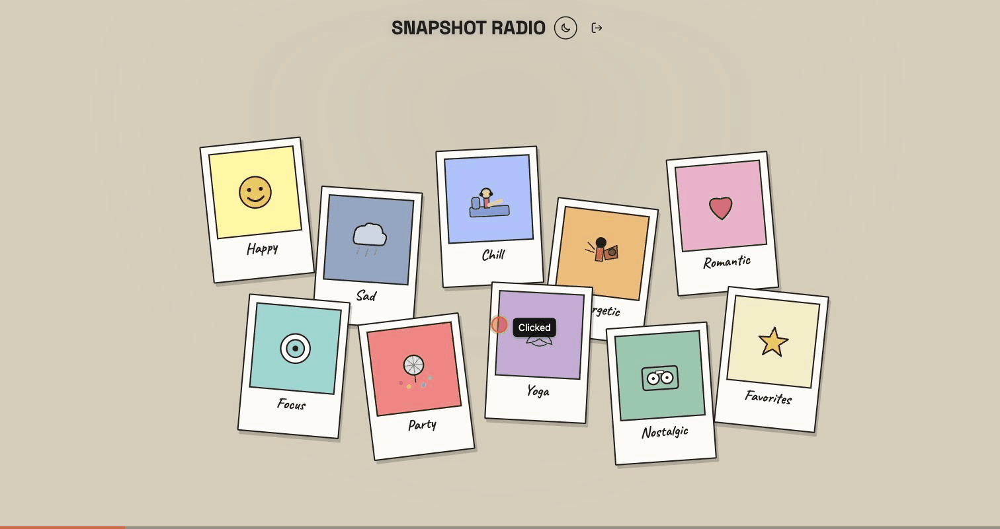

# Snapshot Radio 🎵📸

Pick a mood, get a snapshot of music that matches it — powered by Spotify.

Snapshot Radio turns music discovery into something more playful than a genre dropdown: colorful illustrated "polaroid" cards, each tied to a mood. Tap one and it starts playing right away — the card itself becomes the player, with full playback controls built in.



## How it works

1. **Log in with Spotify** (Premium required for in-browser playback)
2. **Pick a mood** from the scattered polaroid cards on the table
3. Music starts instantly — the card you picked straightens up, grows, and turns into a mini player (track name, artist, play/pause/skip)
4. Pick a different mood any time to switch

## Features

- 🎨 Hand-illustrated mood cards in a warm, paper-cutout art style
- ▶️ Playback control lives inside the card itself — no separate player bar
- ❤️ "Favorites" card shuffle-plays your own Liked Songs, with a heart button in the player to save/remove the current track
- 🌗 Light / dark theme toggle (cards stay "paper", only the table around them darkens)
- 🔀 Shuffled playback from Spotify playlists matched to each mood
- 📱 Responsive layout (scattered polaroids on desktop, grid on mobile)

## Tech stack

- **React + Vite** — no CRA, fast dev server
- **Spotify Web Playback SDK** — real in-browser playback, not just previews
- **Spotify Web API** — playlist search per mood, shuffle, skip
- Plain CSS with design tokens (no Tailwind/component library) — see `src/styles/index.css`

## Getting started

### 1. Clone and install

```bash
git clone https://github.com/YuBlagov/mood-radio-react.git
cd mood-radio-react
npm install
```

### 2. Set up a Spotify app

1. Go to the [Spotify Developer Dashboard](https://developer.spotify.com/dashboard) and create an app
2. In the app's **Settings → Redirect URIs**, add:
   ```
   http://127.0.0.1:5173/
   ```
   > ⚠️ Use `127.0.0.1`, not `localhost` — Spotify only accepts the IP form for local development, and on some systems `localhost` resolves to a different address than `127.0.0.1`, which will silently break login.
3. Copy your **Client ID** from the dashboard

### 3. Add your Client ID

Open `src/config.js` and paste your Client ID:

```js
export const CONFIG = {
  CLIENT_ID: "your-client-id-here",
  ...
};
```

### 4. Run it

```bash
npm run dev
```

Open the URL the terminal prints (should be `http://127.0.0.1:5173/`) — not `localhost`, for the reason above.

**Note:** Spotify Premium is required — the Web Playback SDK doesn't work on Free accounts.

## Project structure

```
src/
  main.jsx                — app entry point
  App.jsx                 — top-level layout, state, and Spotify actions
  config.js               — Client ID and OAuth settings
  moods.js                — mood list, colors, and search queries (single source of truth)
  auth.js                 — Spotify login, code-for-token exchange, refresh
  pkce.js                 — PKCE code_verifier / code_challenge generation
  spotifyApi.js           — playlist search, playback control
  hooks/
    useAuth.js             — React wrapper around auth.js
    useSpotifyPlayer.js    — Web Playback SDK wrapper (device, track, progress)
    useTheme.js            — light/dark theme, persisted in localStorage
  components/
    LoginScreen.jsx
    MoodBoard.jsx          — the scattered polaroid cards, each doubling as a player
    MoodIcon.jsx
    illustrations.jsx      — hand-drawn mood illustrations (SVG)
  styles/
    index.css              — design tokens + all styles
```
